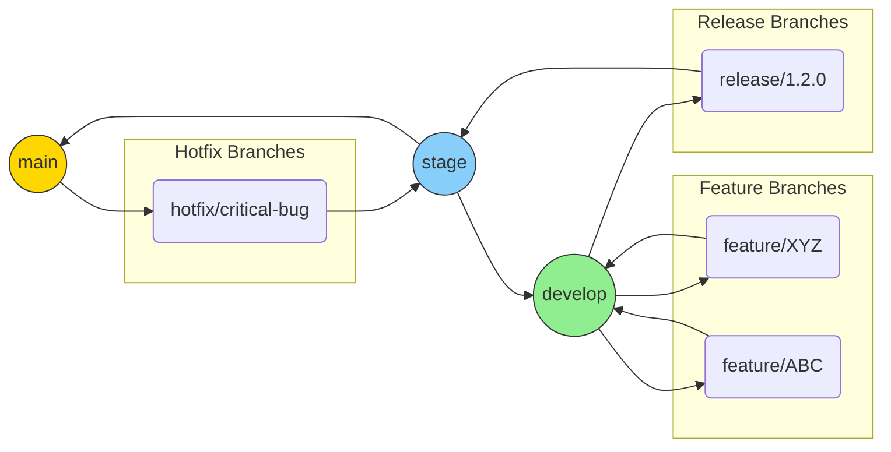

 E-commerce Microservices BackendMore actions

## 📑 Tabla de Contenido

- [Microservicios](microservicios)
- [Punto 1 – Configuración](punto-1-configuración)
  - [Jenkins](jenkins)
  - [Docker](docker)
  - [Kubernetes](kubernetes)
  
- [Punto 2 – Pipeline Dev](punto-2-pipeline-para-dev)
- [Punto 3 – Pruebas](punto-3-pruebas)
  - [Unitarias](pruebas-unitarias)
  - [Integración](pruebas-de-integración)
  - [End-to-End](pruebas-end2end)
  - [Estrés](pruebas-de-estrés)
- [Punto 4 – Pipeline Stage](punto-4-pipeline-de-stage)
- [Punto 5 – Pipeline Master](punto-5-pipeline-de-master)
- [Proyecto Final – Resumen por Requisito](notas-proyecto-final)
  - [1 Metodología Ágil & Branching](punto-1-metodología-ágil-y-estrategia-de-branching)
  - [2 Infraestructura IaC](punto-2-infraestructura-como-código-con-terraform)
  - [3 Patrones de Diseño](punto-3-patrones-de-diseño)
  - [4 CI/CD Avanzado](punto-4-cicd-avanzado)
  - [5 Pruebas Completas](punto-5-pruebas-completas)
  - [6 Change Management](punto-6-change-management-y-release-notes)
  - [7 Observabilidad & Monitoreo](punto-7-observabilidad-y-monitoreo)
  - [8 Seguridad](punto-8-seguridad)
  - [9 Documentación & Presentación](punto-9-documentación-y-presentación)

### Sistema de Microservicios con Jenkins y Kubernetes

---

##  Descripción del Proyecto

Sistema de microservicios e-commerce con arquitectura distribuida:
- ✅ **6 microservicios** principales
- ✅ **Jenkins** para CI/CD
- ✅ **Kubernetes** para orquestación
- ✅ **Spring Cloud** para gestión de servicios

---

## Microservicios

| Servicio | Puerto | Descripción |
|----------|--------|-------------|
| **API Gateway** | 8080 | Punto de entrada único para todos los servicios |
| **Cloud Config** | 8888 | Configuración centralizada |
| **Service Discovery** | 8761 | Registro de servicios (Eureka) |
| **Order Service** | 8081 | Gestión de órdenes |
| **Product Service** | 8082 | Catálogo de productos |
| **User Service** | 8083 | Gestión de usuarios |

---

## Tecnologías Utilizadas

- **Backend**: Spring Boot, Spring Cloud
- **Base de Datos**: PostgreSQL
- **CI/CD**: Jenkins
- **Contenedores**: Docker
- **Orquestación**: Kubernetes
- **Service Discovery**: Eureka
- **Configuración**: Spring Cloud Config

---

## Scripts Disponibles

| Script | Descripción |
|--------|-------------|
| `start-jenkins.sh` | Inicia Jenkins en Docker |
| `restart-jenkins.sh` | Reinicia Jenkins |
| `docker-compose.dev.yml` | Configuración de desarrollo |
| `docker-compose.jenkins.yml` | Configuración de Jenkins |

---

##  Pruebas

### Pruebas Unitarias
- UserService
- OrderService
- ProductService

### Pruebas de Integración
- API Gateway
- Service Discovery
- Cloud Config

---

## Estructura del Proyecto

```
TALLER2INGESOFT/
├──  Microservicios
│   ├── api-gateway/
│   ├── cloud-config/
│   ├── order-service/
│   ├── product-service/
│   ├── service-discovery/
│   └── user-service/
├──  Jenkins
│   ├── docker-compose.jenkins.yml
│   ├── start-jenkins.sh
│   └── restart-jenkins.sh
├── Kubernetes
│   └── k8s/
└── Configuración
    ├── docker-compose.dev.yml
    └── compose.yml
```

---

##  Comandos Útiles

```bash
# Ver logs de Jenkins
docker-compose -f docker-compose.jenkins.yml logs jenkins

# Ver servicios en ejecución
docker-compose -f docker-compose.dev.yml ps

# Acceder a Jenkins
http://localhost:8080

# Ver logs de un microservicio
docker-compose -f docker-compose.dev.yml logs -f [servicio]
```

---

## Troubleshooting

### Jenkins no inicia
```bash
# Verificar logs
docker-compose -f docker-compose.jenkins.yml logs jenkins

# Reiniciar Jenkins
./restart-jenkins.sh
```

### Microservicios no responden
```bash
# Verificar estado
docker-compose -f docker-compose.dev.yml ps

# Reiniciar servicios
docker-compose -f docker-compose.dev.yml restart
```

---

## 🌐 Arquitectura Lógica


---


## 🏗️ Infraestructura como Código (Terraform)

| Carpeta | Propósito |
|---------|-----------|
| `terraform/modules/network` | VNet / VPC, subredes, reglas de seguridad |
| `terraform/modules/kubernetes` | Creación del clúster AKS/EKS + Node Pools |
| `terraform/modules/database` | MySQL/PostgreSQL gestionado |
| `terraform/modules/monitoring` | Prometheus + Grafana helm charts |
| `terraform/envs/dev|stage|prod` | Variables específicas de cada ambiente |


```bash
# Ejemplo despliegue Stage
aws sso login               # o az login / gcloud auth
terraform init
terraform plan              # backend remoto ya configurado
terraform apply 
```

> _Figura 2 – Captura de `terraform apply` con cambios planificados_  
>


---

## 📋 Metodología Ágil – Kanban

Para la gestión del proyecto se adoptó **Kanban**, maximizando flujo y entrega continua.

| Columna | Descripción | Límite WIP |
|---------|-------------|------------|
| Backlog | Historias priorizadas por el PO | — |
| To Do | Listas para iniciar en el sprint actual | 8 |
| In Progress | Desarrollo activo | 4 |
| Code Review | PR abiertos esperando revisión | 3 |
| Testing | QA manual y pruebas E2E | 4 |
| Done | Listo para deploy / merge a `develop` | — |


Políticas:
* Daily stand-up de 10 min para gestionar flujo.
* Revisión continua, sin iteraciones fijas; demo al final de cada _release_ de **2 semanas**.
* Criterios DoD incluyen cobertura ≥ 80 % y build verde.

---

## 🔄 Estrategia de Branching (GitFlow extendido)



Ramas principales:
* **main** → Producción.
* **stage** → Pre-producción, validación finales.
* **develop** → Integración continua.

Ramas de soporte:
* **feature/** → nuevas funcionalidades, parten de `develop`.
* **release/** → estabilización previo a `stage / main`.
* **hotfix/** → correcciones críticas, parten de `main`.

Reglas clave:
1. _Merge_ a `main` sólo mediante `release/*` o `hotfix/*`.
2. Cada PR requiere 2 aprobaciones + build "verde".
3. Etiquetado semver automático (`vMAJOR.MINOR.PATCH`) al fusionar a `main`.

---

## ⚙️ CI/CD con Jenkins


Pasos clave:
1. **Build & Test** – `mvn test` + JaCoCo.
2. **Quality Gate** – SonarQube, Trivy.
3. **Build Image** – Docker + tag semver (`v${BUILD_NUMBER}`).
4. **Deploy Dev / Stage** – Helm upgrade, pruebas Integration/E2E.
5. **Aprobación manual** – despliegue a Producción.
6. **Post-deploy** – Locust + ZAP.

Snippet aprobación manual:
```groovy
input message: "¿Promocionar a producción?", ok: "Deploy"
```

---

## 🧪 Estrategia de Pruebas

| Tipo | Framework | Ubicación | Comando |
|------|-----------|-----------|---------|
| Unitarias | JUnit 5 + Mockito | `*/src/test/java` | `mvn test` |
| Integración | SpringBootTest + Testcontainers | `*IT.java` | `mvn verify` |
| E2E | JUnit 5 (Failsafe) | `test/java/com/.../EcommerceE2EFlowTest.java` | `mvn verify` |
| Rendimiento | Locust | `performance/` | `./run-performance-tests.sh` |
| Seguridad | OWASP ZAP | `performance/Jenkinsfile` | ejecutado en pipeline |

>
> – Reporte Locust_  


La mayoria de pruebas se realizaron por medio de un pipeline en el cual cada que se sube un cambio al proyecto se compruebe que todo funcione correctamente, se estan testeando las pruebas de integracion, e2e y unitarias.


---

## 📈 Observabilidad y Monitoreo

* **Prometheus** – recolección de métricas técnicas y de negocio (`/actuator/prometheus`).
* **Grafana** – dashboards `User Signup`, `Order Latency`, `CPU / Memory`.
* **ELK** – logs centralizados con filtrado por microservicio.
* **Jaeger** – trazas distribuidas.
* **Alertmanager** – alertas Slack `#alerts`.


---

## 🔐 Seguridad

* Escaneo de imágenes – **Trivy** en la etapa Build (`mvn clean package`).
* Escaneo dinámico – **OWASP ZAP Baseline** contra API Gateway.
* Gestión de secretos – **Kubernetes Secrets** + **Azure Key Vault** (en producción).
* RBAC K8s – políticas por namespace.

---

## 🛠️ Plan de Cambio & Release Notes

| Paso | Herramienta |
|------|-------------|
| Registrar cambio | Issue GitHub + plantilla |
| Desarrollo | Rama `feature/*` |
| PR + Revisión | 2 reviewers obligatorios |
| Merge a `develop` | Pipeline automático |
| Tag versión | Release-please Action |
| Publicar Release Notes | generados en Markdown |


## 🚀 Despliegue en Kubernetes

```bash
# 1. Construir imagen local y subir al ACR/ECR
mvn -pl product-service clean package -DskipTests
az acr build -t product-service:v1 -r ecommerceacr .

# 2. Desplegar chart Helm (Dev)
helm upgrade --install product-service helm/product-service \
  --namespace dev \
  --set image.tag=v1

# 3. Verificar pods
kubectl get pods -n dev -w

# 4. Consultar logs
kubectl logs -f deployment/product-service -n dev

# 5. Rollback rápido
helm rollback product-service 1 -n dev
```

---

## 🗃️ Flujo Terraform – Ciclo de Vida Completo

```bash
# Crear nueva feature branch de infra
git checkout -b feature/tf-add-cache

# Formatear y validar
terraform fmt -recursive
terraform validate

# Previsualizar cambios en Stage
cd terraform/envs/stage
terraform plan -var-file=stage.tfvars -out=tfplan
terraform show tfplan

# Aplicar cambios
terraform apply tfplan

# Cuando se necesite destruir un entorno efímero
terraform destroy 
```

---

## 🐳 Docker & Compose

```bash
# Build multi-arch para product-service
docker buildx build --platform linux/amd64,linux/arm64 \
  -t ecommerceacr.azurecr.io/product-service:latest . --push

# Levantar stack completo en local (Dev)
docker compose -f compose.yml up -d

docker compose ps
```

---

## 📂 Scripts de Mantenimiento

| Script | Descripción |
|--------|-------------|
| `scripts/backup-db.sh` | Crea dump de todas las BDs y lo sube a Blob Storage |
| `scripts/rotate-logs.sh` | Rota y comprime logs locales > 7 días |
| `scripts/scale.sh` | Aumenta réplicas via `kubectl scale` |

```bash
# ejemplo backup
./scripts/backup-db.sh --env stage --output backups/
```

---

## 🛡️ Validación de Seguridad Local

```bash
# Analizar vulnerabilidades de una imagen
trivy image ecommerceacr.azurecr.io/product-service:latest

# Escaneo ZAP (baseline)
docker run --rm -v $(pwd):/zap/wrk owasp/zap2docker-stable \
  zap-baseline.py -t http://localhost:8080 -r zap_local.html
```

